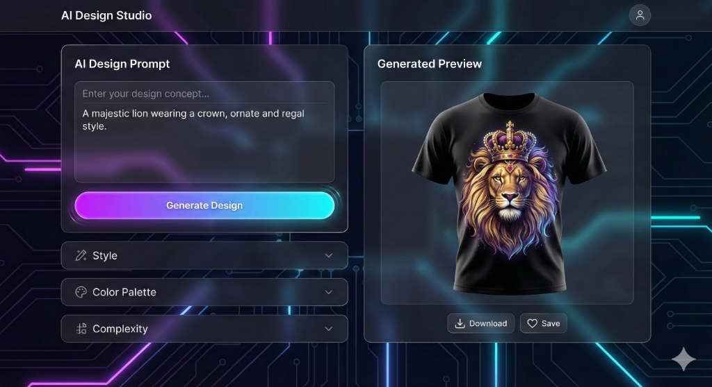
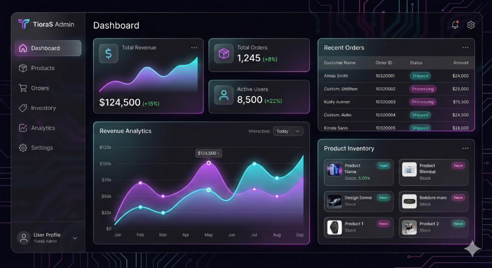

<div align="center">

# 🎨 TioraS Studio

### AI-Powered Custom Apparel Design & E-Commerce Platform

[](https://nextjs.org/)
[](https://reactjs.org/)
[](https://www.typescriptlang.org/)
[](https://firebase.google.com/)
[](LICENSE)

**Transform ideas into custom apparel with AI-powered design generation**

[🚀 Live Demo](#) • [📖 Documentation](#features) • [🐛 Report Bug](https://github.com/prashant13-bh/TioraS-Studio/issues) • [✨ Request Feature](https://github.com/prashant13-bh/TioraS-Studio/issues)

</div>

---

## 📸 Screenshots

> **Note**: Screenshots coming soon! Run the app locally to see the beautiful UI in action.

<!--



-->

---

## ✨ Features

### 🤖 AI Design Studio

- **Text-to-Image Generation**: Transform text prompts into stunning custom designs using **Google Imagen 4.0**
- **Real-time Preview**: Instantly visualize your designs on different apparel (T-Shirts, Hoodies, Jackets, Caps)
- **Save & Download**: Store designs to your account or download for printing
- **AI-Powered**: Leverages Google Genkit and HuggingFace for cutting-edge image generation

### 🛒 Complete E-Commerce System

- **Product Catalog**: Browse and filter custom apparel products
- **Shopping Cart**: Persistent cart with real-time price calculations
- **Secure Checkout**: Streamlined checkout process with Firebase integration
- **Order Management**: Track order history and status
- **User Accounts**: Firebase Authentication with Google Sign-In

### 👨‍💼 Comprehensive Admin Dashboard

- **📊 Analytics Dashboard**: Revenue charts, sales metrics, and performance indicators
- **📦 Product Management**: Full CRUD operations for inventory
- **📋 Order Processing**: View, update, and manage customer orders
- **📊 Inventory Tracking**: Stock-in/stock-out with barcode scanning
- **📄 Invoice Generation**: Automated PDF invoice creation
- **👥 User Management**: Role-based access control
- **⭐ Review Moderation**: Manage product reviews
- **📅 Calendar**: Event and schedule management
- **🔧 System Settings**: Platform configuration

### 🎨 Advanced Design Features

- **3D Rendering**: Three.js-powered 3D garment visualization
- **Canvas Editing**: Interactive design manipulation
- **Dark/Light Mode**: Seamless theme switching
- **Responsive Design**: Mobile-first, works on all devices

### 📊 Inventory & Operations

- **Barcode System**: Generate and scan barcodes/QR codes for inventory
- **Stock Management**: Real-time stock tracking with automated alerts
- **Export Tools**: CSV/Excel export for data analysis
- **Multi-user Support**: Team collaboration features

---

## 🚀 Tech Stack

### Frontend

- **Framework**: [Next.js 15.3.6](https://nextjs.org/) with App Router
- **UI Library**: [React 19.2.1](https://reactjs.org/)
- **Styling**: [TailwindCSS 3.4](https://tailwindcss.com/) + [Shadcn/UI](https://ui.shadcn.com/)
- **3D Graphics**: [Three.js](https://threejs.org/) + React Three Fiber
- **Animations**: [Framer Motion](https://www.framer.com/motion/), [GSAP](https://greensock.com/gsap/)
- **State Management**: [Zustand](https://zustand-demo.pmnd.rs/)
- **Forms**: [React Hook Form](https://react-hook-form.com/) + [Zod](https://zod.dev/)
- **Charts**: [ApexCharts](https://apexcharts.com/), [Recharts](https://recharts.org/)

### Backend & AI

- **AI Framework**: [Google Genkit 1.20](https://firebase.google.com/docs/genkit)
- **Image Generation**: Google Imagen 4.0
- **Alternative AI**: [HuggingFace Inference](https://huggingface.co/)
- **Database**: [Firebase Firestore](https://firebase.google.com/docs/firestore)
- **Authentication**: [Firebase Auth](https://firebase.google.com/docs/auth)
- **Storage**: [Firebase Storage](https://firebase.google.com/docs/storage)
- **Email**: [Nodemailer](https://nodemailer.com/)

### Additional Tools

- **Barcode**: [bwip-js](https://github.com/metafloor/bwip-js), [@yudiel/react-qr-scanner](https://www.npmjs.com/package/@yudiel/react-qr-scanner)
- **PDF**: [jsPDF](https://github.com/parallax/jsPDF)
- **Data Export**: [XLSX](https://sheetjs.com/), [PapaParse](https://www.papaparse.com/)
- **Calendar**: [FullCalendar](https://fullcalendar.io/)
- **Analytics**: [Vercel Analytics](https://vercel.com/analytics)

---

## 📦 Installation

### Prerequisites

- **Node.js** 20.x or higher
- **npm** or **pnpm**
- **Firebase Account** (for backend services)
- **Google Cloud Account** (for Genkit AI)

### Step 1: Clone Repository

```bash
git clone https://github.com/prashant13-bh/TioraS-Studio.git
cd TioraS-Studio
```

### Step 2: Install Dependencies

```bash
npm install
# or
pnpm install
```

### Step 3: Environment Setup

Create a `.env.local` file in the root directory:

```env
# Firebase Configuration
NEXT_PUBLIC_FIREBASE_API_KEY=your_api_key
NEXT_PUBLIC_FIREBASE_AUTH_DOMAIN=your_auth_domain
NEXT_PUBLIC_FIREBASE_PROJECT_ID=your_project_id
NEXT_PUBLIC_FIREBASE_STORAGE_BUCKET=your_storage_bucket
NEXT_PUBLIC_FIREBASE_MESSAGING_SENDER_ID=your_sender_id
NEXT_PUBLIC_FIREBASE_APP_ID=your_app_id

# Firebase Admin (Server-side)
FIREBASE_PROJECT_ID=your_project_id
FIREBASE_CLIENT_EMAIL=your_client_email
FIREBASE_PRIVATE_KEY=your_private_key

# Google Genkit AI
GOOGLE_GENAI_API_KEY=your_genai_api_key

# HuggingFace (Optional)
HUGGINGFACE_API_KEY=your_hf_api_key
```

### Step 4: Firebase Setup

1. Create a Firebase project at [console.firebase.google.com](https://console.firebase.google.com)
2. Enable **Firestore Database**
3. Enable **Authentication** (Email/Password & Google)
4. Enable **Storage**
5. Download and add `google-services.json` to project root

### Step 5: Initialize Firestore

Deploy security rules:

```bash
firebase deploy --only firestore:rules
firebase deploy --only storage:rules
```

### Step 6: Run Development Server

```bash
npm run dev
```

Open [http://localhost:3000](http://localhost:3000) in your browser.

---

## 🎯 Usage

### For Customers

1. **Browse Products**: Explore the custom apparel catalog
2. **Create Design**: Visit `/design-studio` to generate AI-powered designs
3. **Customize**: Enter a text prompt (e.g., "A majestic lion wearing a crown")
4. **Generate**: Let AI create your unique design
5. **Save/Download**: Save to your account or download the image
6. **Order**: Add products to cart and checkout

### For Administrators

1. **Access Admin Panel**: Navigate to `/admin` (requires admin role)
2. **Manage Products**: Add, edit, or remove products
3. **Process Orders**: View and update customer orders
4. **Track Inventory**: Use barcode scanner for stock management
5. **View Analytics**: Monitor sales and revenue metrics
6. **Generate Reports**: Export data for analysis

---

## 📁 Project Structure

```
TioraS-Studio/
├── src/
│   ├── app/                    # Next.js App Router pages
│   │   ├── admin/              # Admin dashboard
│   │   ├── design-studio/      # AI Design Studio
│   │   ├── products/           # Product catalog
│   │   ├── cart/               # Shopping cart
│   │   ├── orders/             # Order management
│   │   └── ...
│   ├── components/             # Reusable components
│   │   ├── ui/                 # Shadcn/UI components
│   │   ├── canvas/             # 3D Three.js components
│   │   ├── barcode/            # Barcode scanner/generator
│   │   └── ...
│   ├── ai/                     # Genkit AI flows
│   │   ├── flows/              # AI generation flows
│   │   └── genkit.ts           # Genkit configuration
│   ├── firebase/               # Firebase configuration
│   └── lib/                    # Utility functions
├── public/                     # Static assets
├── docs/                       # Documentation & images
├── firestore.rules             # Firestore security rules
├── storage.rules               # Storage security rules
├── package.json
└── README.md
```

---

## 🔐 Security & Privacy

- ✅ **Firebase Security Rules**: Robust Firestore and Storage rules
- ✅ **Role-Based Access**: Admin panel protected by custom claims
- ✅ **Environment Variables**: Sensitive keys stored securely
- ✅ **Input Validation**: Zod schemas for all forms
- ✅ **XSS Protection**: React's built-in protections
- ✅ **HTTPS Only**: All communications encrypted

---

## 🚧 Roadmap

### Phase 1: Core Enhancement (Q1 2026)

- [ ] Advanced AI design tools (inpainting, style variations)
- [ ] Payment gateway integration (Stripe/PayPal)
- [ ] Enhanced mobile experience
- [ ] Performance optimizations

### Phase 2: Advanced Features (Q2 2026)

- [ ] Multi-vendor marketplace
- [ ] Advanced analytics dashboard
- [ ] Subscription plans
- [ ] Print-on-demand fulfillment (Printful/Printify)

### Phase 3: Scaling (Q3 2026)

- [ ] Internationalization (i18n)
- [ ] Progressive Web App (PWA)
- [ ] Real-time collaboration
- [ ] Advanced SEO optimizations

---

## 🤝 Contributing

Contributions are **greatly appreciated**! Here's how you can help:

1. **Fork** the repository
2. **Create** your feature branch (`git checkout -b feature/AmazingFeature`)
3. **Commit** your changes (`git commit -m 'Add some AmazingFeature'`)
4. **Push** to the branch (`git push origin feature/AmazingFeature`)
5. **Open** a Pull Request

Please read [CONTRIBUTING.md](CONTRIBUTING.md) for details on our code of conduct and the process for submitting pull requests.

---

## 📄 License

This project is licensed under the **MIT License** - see the [LICENSE](LICENSE) file for details.

### MIT License Summary

```
Copyright (c) 2026 TioraS Studio

Permission is hereby granted, free of charge, to any person obtaining a copy
of this software and associated documentation files (the "Software"), to deal
in the Software without restriction, including without limitation the rights
to use, copy, modify, merge, publish, distribute, sublicense, and/or sell
copies of the Software, and to permit persons to whom the Software is
furnished to do so, subject to the following conditions:

The above copyright notice and this permission notice shall be included in all
copies or substantial portions of the Software.

THE SOFTWARE IS PROVIDED "AS IS", WITHOUT WARRANTY OF ANY KIND, EXPRESS OR
IMPLIED, INCLUDING BUT NOT LIMITED TO THE WARRANTIES OF MERCHANTABILITY,
FITNESS FOR A PARTICULAR PURPOSE AND NONINFRINGEMENT. IN NO EVENT SHALL THE
AUTHORS OR COPYRIGHT HOLDERS BE LIABLE FOR ANY CLAIM, DAMAGES OR OTHER
LIABILITY, WHETHER IN AN ACTION OF CONTRACT, TORT OR OTHERWISE, ARISING FROM,
OUT OF OR IN CONNECTION WITH THE SOFTWARE OR THE USE OR OTHER DEALINGS IN THE
SOFTWARE.
```

---

## 🙏 Acknowledgments

- **Google Genkit** - For AI framework and Imagen 4.0 integration
- **Vercel** - For Next.js and deployment platform
- **Firebase** - For backend infrastructure
- **Shadcn** - For beautiful UI components
- **HuggingFace** - For AI model alternatives
- **Open Source Community** - For amazing tools and inspiration

### Special Thanks To:

- React Three Fiber community for 3D rendering examples
- TailwindCSS team for the incredible styling framework
- All contributors and supporters of this project

---

## 📞 Contact & Support

- **Email**: ph293815@gmail.com
- **LinkedIn**: [Prashant Hiremath](https://www.linkedin.com/in/prashant-hiremath-13pbh/)
- **Issues**: [GitHub Issues](https://github.com/prashant13-bh/TioraS-Studio/issues)
- **Discussions**: [GitHub Discussions](https://github.com/prashant13-bh/TioraS-Studio/discussions)
- **Twitter**: [@TioraS_Studio](https://twitter.com/tiorasstudio)

---

## 📊 Project Stats


---

<div align="center">

**Made with ❤️ by [Prashant Hiremath](https://www.linkedin.com/in/prashant-hiremath-13pbh/)**

If you found this project helpful, please give it a ⭐!

[⬆ Back to Top](#-tioras-studio)

</div>
